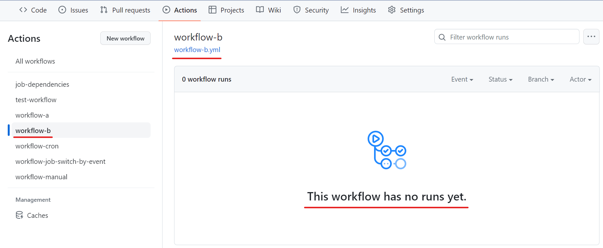

# GitHub Actionsについて

- [GitHub Actionsについて](#github-actionsについて)
  - [GitHub Actionsとは](#github-actionsとは)
  - [キーワード](#キーワード)
  - [定義ファイルの書き方](#定義ファイルの書き方)
    - [ざっくり図解](#ざっくり図解)
    - [シンプルな例](#シンプルな例)
  - [〇〇したいときの書き方](#〇〇したいときの書き方)
    - [ワークフローを手動実行する](#ワークフローを手動実行する)
    - [ワークフローAからワークフローBを呼び出す](#ワークフローaからワークフローbを呼び出す)
    - [ワークフローを指定した時間に実行する](#ワークフローを指定した時間に実行する)
    - [ジョブの依存関係(前提条件)を設定する](#ジョブの依存関係前提条件を設定する)
    - [ジョブ・ステップで条件分岐](#ジョブステップで条件分岐)
    - [ジョブAの出力をジョブBで使用する](#ジョブaの出力をジョブbで使用する)
  - [躓いた点](#躓いた点)

## GitHub Actionsとは
> GitHub Actions は、ビルド、テスト、デプロイのパイプラインを自動化できる継続的インテグレーションと継続的デリバリー (CI/CD) のプラットフォームです。リポジトリに対するすべての pull request をビルドしてテストしたり、マージされた pull request を運用環境にデプロイしたりするワークフローを作成できます。

引用元 : [GitHub Docs](https://docs.github.com/ja/actions/learn-github-actions/understanding-github-actions#:~:text=GitHub%20Actions%20%E3%81%AF%E3%80%81%E3%83%93%E3%83%AB%E3%83%89%E3%80%81%E3%83%86%E3%82%B9%E3%83%88%E3%80%81%E3%83%87%E3%83%97%E3%83%AD%E3%82%A4%E3%81%AE%E3%83%91%E3%82%A4%E3%83%97%E3%83%A9%E3%82%A4%E3%83%B3%E3%82%92%E8%87%AA%E5%8B%95%E5%8C%96%E3%81%A7%E3%81%8D%E3%82%8B%E7%B6%99%E7%B6%9A%E7%9A%84%E3%82%A4%E3%83%B3%E3%83%86%E3%82%B0%E3%83%AC%E3%83%BC%E3%82%B7%E3%83%A7%E3%83%B3%E3%81%A8%E7%B6%99%E7%B6%9A%E7%9A%84%E3%83%87%E3%83%AA%E3%83%90%E3%83%AA%E3%83%BC%20(CI/CD)%20%E3%81%AE%E3%83%97%E3%83%A9%E3%83%83%E3%83%88%E3%83%95%E3%82%A9%E3%83%BC%E3%83%A0%E3%81%A7%E3%81%99%E3%80%82%20%E3%83%AA%E3%83%9D%E3%82%B8%E3%83%88%E3%83%AA%E3%81%AB%E5%AF%BE%E3%81%99%E3%82%8B%E3%81%99%E3%81%B9%E3%81%A6%E3%81%AE%20pull%20request%20%E3%82%92%E3%83%93%E3%83%AB%E3%83%89%E3%81%97%E3%81%A6%E3%83%86%E3%82%B9%E3%83%88%E3%81%97%E3%81%9F%E3%82%8A%E3%80%81%E3%83%9E%E3%83%BC%E3%82%B8%E3%81%95%E3%82%8C%E3%81%9F%20pull%20request%20%E3%82%92%E9%81%8B%E7%94%A8%E7%92%B0%E5%A2%83%E3%81%AB%E3%83%87%E3%83%97%E3%83%AD%E3%82%A4%E3%81%97%E3%81%9F%E3%82%8A%E3%81%99%E3%82%8B%E3%83%AF%E3%83%BC%E3%82%AF%E3%83%95%E3%83%AD%E3%83%BC%E3%82%92%E4%BD%9C%E6%88%90%E3%81%A7%E3%81%8D%E3%81%BE%E3%81%99%E3%80%82) (以降、引用元を省略している引用文の引用元はGitHub Docsとする)  

ローカルリポジトリからGitHubリポジトリへのpushや、PR作成等の操作をトリガーとして、事前に定義しておいた処理(ワークフロー)を実行できます。

プライベートリポジトリでGitHub Actionsを利用する場合、処理時間が1ヶ月で2000分を超えるとコストが発生します。パブリックブランチで使用する分にはタダです。  
参考 : [GitHub - プランご紹介](https://github.co.jp/pricing.html#:~:text=%E3%81%AF%E7%84%A1%E6%96%99%E3%81%A7%E3%81%99%E3%80%82-,2%2C000%E5%88%86/%E6%9C%88,%E3%83%91%E3%83%96%E3%83%AA%E3%83%83%E3%82%AF%E3%83%AA%E3%83%9D%E3%82%B8%E3%83%88%E3%83%AA%E3%81%A7%E3%81%AF%E7%84%A1%E6%96%99,-3%2C000%E5%88%86/%E6%9C%88)

## キーワード
個人的に重要と感じた用語をピックアップしました。  
まだ触れられていない機能も多いので、今後ほかにも色々触ってみて必要であれば追記しようと思います。  

自分の言葉での説明が難しかったので、具体例（退勤打刻後にすぐ夕食準備をするような場面ではどの部分か）を記載しました。  
※不要であれば読み飛ばしてください。  

- ワークフロー :  
  > 1 つ以上のジョブを実行する構成可能な自動化プロセスです。

  GitHub Actionsでは、ジョブとステップという単位で処理を定義します。  
  ワークフローは1つ以上のジョブで構成され、さらにジョブは1つ以上のステップで構成されます。  

  ※具体例でいうと、夕食準備（「素材ごとの下準備」→「煮込む」→「盛り付け」のような一連の流れ）になります。  

- イベント :  
  > ワークフロー実行をトリガーする、リポジトリ内の特定のアクティビティです。 たとえば、pull request が作成されたとき、issue が開かれたとき、またはリポジトリにコミットがプッシュされたときに、GitHub からアクティビティを発生させることができます。

  「[トリガーとなるイベント](https://docs.github.com/ja/actions/using-workflows/events-that-trigger-workflows)」にて、使用できるイベントを確認できます。  
  ※具体例でいうと、「退勤打刻」になります。  

- ランナー :  
  > ワークフローがトリガーされると実行されるサーバーです。各ランナーでは、一度に 1 つのジョブを実行できます。

  ジョブを処理する環境です。  
 「 [ジョブのランナー](https://docs.github.com/ja/actions/using-jobs/choosing-the-runner-for-a-job)」にて、使用できるランナーを確認できます。  
  ※具体例でいうと、「コンロ」とか「作業台」になりそうです。

- ジョブ :  
  > 同じランナーで実行される、ワークフロー内の一連の ステップ です。

  ワークフローを構成するの一塊の処理のことです。  
  ※具体例でいうと、「素材ごとの下準備」等、夕食準備の1つ1つの工程になります。  

- ステップ :  
  ジョブを構成する1つ1つの処理のことです。  
  各ステップは、ユーザーが定義したスクリプトか、アクションを実行でき

  ※具体例でいうと、ジョブを「素材ごとの下準備」としたときの「皮むき」や「1口大に切る」等になります。  

- アクション :  
  > GitHub Actions 用のカスタム アプリケーションであり、複雑で頻繁に繰り返されるタスクを実行します。 アクションを使用すると、ワークフロー ファイルに記述する繰り返しコードの量を削減するのに役立ちます。

  ※具体例は難しいのでスキップします。  

- コンテキスト :  
  ワークフローを呼び出したイベントがpushなのかPR作成なのかや、ベースブランチやヘッドブランチ等の情報のことです。  
  (例)"github.event_name" でワークフローを呼び出したイベントが何か取得でき、条件分岐等で使用できます。  
  「[コンテキスト](https://docs.github.com/ja/actions/learn-github-actions/contexts)」にて、使用可能な情報を確認できます。  
  ※具体例は難しいのでスキップします。  

## 定義ファイルの書き方
ワークフローは、yml(yaml)形式で定義し、「<リポジトリ>/.github/workflows/」ディレクトリ配下に配置します。  
> ワークフローは、リポジトリにチェックインされる YAML ファイルによって定義され、リポジトリ内のイベントによってトリガーされたときに実行されます。また、手動でトリガーしたり、定義されたスケジュールでトリガーしたりすることもできます。  
> ワークフローはリポジトリ内の .github/workflows ディレクトリで定義され、リポジトリには複数のワークフローを含めることができます。  

### ざっくり図解


### シンプルな例
シンプルな定義ファイルと説明、実行結果を記載します。  

- シンプルな定義ファイル  
  ```yml
  name: test-workflow
  on:
    pull_request:
      branches:
        - main
  env:
    DAY_OF_WEEK: Monday
  jobs:
    job-1:
      runs-on: ubuntu-latest
      steps:
        - name: step-1
          uses: actions/checkout@v3

        - name: step-2
          run: echo "this is job-1."
    job-2:
      runs-on: ubuntu-latest
      env:
        HELLO: hello!!
      steps:
        - name: step-1
          env:
            NAME: Taro
          run: |
            echo "$HELLO $NAME."
            echo "Today is $DAY_OF_WEEK!"
  ```

- 説明  
  テンプレートで使用している属性の説明は下で表にしてます。  
  上記ワークフローは、"main" ブランチへのPR作成時によりトリガーされ、job1とjob2をそれぞれ "Ubuntu" 上で実行します。  

  "job1" では "step1" を実行した後に "step2" が実行されます。"step1" では、GitHub が提供しているアクション「checkout」のバージョン3を実行し、Ubuntu上にリポジトリのクローンを作成します。"step2" では、文字列を出力するシェルを実行します。  

  "job2" では "step1" が実行されます。「ワークフロー全体で使用可能」「ジョブ内で使用可能」「ステップ内で使用可能」の3つの環境変数を使って文字列を出力します。  YAMLの記法により、シェルは複数行記載可能です。  

  |属性|用途|備考|
  |:--|:--|:--|
  |name|ワークフローの名前||
  |on|ワークフローのトリガーとなるイベント|今回は main ブランチ向けのPR作成時をトリガーに設定しました。|
  |env|ワークフロー全体の環境変数||
  |jobs|インデントを下げて複数のジョブを定義|"job-1" や "job-2" はジョブIDと呼ばれます。|
  |jobs.<ジョブID>.runs-on|ランナーを指定|ubuntu-latestを設定すると「Ubuntu 22.04」上でジョブを実行する(2023年4月時点)<br>Windows Server や Mac OS の選択も可能です。|
  |jobs.<ジョブID>.env|ジョブ内で使用可能な環境変数||
  |jobs.<ジョブID>.steps|インデントを下げて複数のステップを定義|"name" は省略可能です。|
  |jobs.<ジョブID>.steps[*].env|ステップ内で使用可能な環境変数||
  |jobs.<ジョブID>.steps[*].uses|アクションを使用|ステップごとに "uses" or "run" が必要|
  |jobs.<ジョブID>.steps[*].run|自分でスクリプトを定義|ステップごとに "uses" or "run" が必要|

- 実行結果  
  下記画像のようにPR画面で各ジョブの実行結果を確認できます。  
  

  下記画像のように、「Actions」タブに切り替えることにより、ざっくりどんな順序でジョブが実行されたか(画像右下の灰色部分)を確認できます。ジョブの依存関係が複雑になると、想定通りの順序でジョブが実行されているかの確認等で役立ちそうです。  

  ※「[〇〇したいときの書き方](#〇〇したいときの書き方)」にて記載しますが、ジョブに依存関係を設定可能で、下記のような設定も可能です。
  - ジョブ1が完了した後にジョブ2を実行する  
  - ジョブ1が成功した場合はジョブ2を実行し、ジョブ1が失敗した場合はジョブ2をスキップする  

  

  また、ジョブを選択することにより、「どのスクリプトでどんなエラーが発生しているか」等、ステップごとに詳細を確認できます。  
  「Set up job」や「Complete job」は定義してなくても必ず実行されるステップです。  
  

## 〇〇したいときの書き方
### ワークフローを手動実行する
- ポイント  
  - イベントに `workflow_dispatch` を指定する。  
  - イベント指定時に `inputs` 属性を指定すると、手動実行時にワークフローへ入力できる。  

- 定義例  
  ```yml
  name: workflow-manual
  on:
    workflow_dispatch:
      inputs:
        env:
          required: true
          type: choice
          options:
            - dev
            - prod
  jobs:
    echo-env:
      runs-on: ubuntu-latest
      steps:
        - run: echo "env = ${{ github.event.inputs.env }}"
  ```

- 手動実行する手順  
  1. 「Actions」タブへ切り替え、左ペインにて実行したいワークフローを選択する。  
  2. 右上の「Run workflow」を押下し、ワークフローへの入力を設定して、「Run workflow」ボタンを押下する。  

  
  

- 実行結果  
  

### ワークフローAからワークフローBを呼び出す
- ポイント  
  - 呼び出し元のワークフロー(caller workflowと呼ぶ)側のポイント  
    - ステップにて、`uses` を使って、呼び出したいワークフローの定義ファイルを指定する。  
    - ワークフロー呼び出しと同じステップにて、`with` 属性を指定すると、ワークフローへ入力できる。  
  - 呼び出されるワークフロー(called workflowと呼ぶ)側のポイント  
    - イベントに `workflow_call` を指定する。  
    - イベント指定時に `inputs` 属性を指定すると、呼び出される時のワークフローへの入力を設定できる。  

- 定義例  
  ```yml
  name: workflow-a
  on:
    workflow_dispatch:
      inputs:
        env:
          required: true
          type: choice
          options:
            - dev
            - prod
  jobs:
    kick-workflow-b:
      uses: ./.github/workflows/workflow-b.yml
      with:
        env: ${{ github.event.inputs.env }}
  ```

  ```yml
  name: workflow-b
  on:
    workflow_call:
      inputs:
        env:
          required: true
          type: string
  jobs:
    echo-env:
      runs-on: ubuntu-latest
      steps:
        - run: echo "env = ${{ inputs.env }}"
  ```

- 実行結果  
  - 呼び出し元のワークフロー  
    
  - 呼び出されたワークフロー  
    いつ誰に呼び出されたか等、実行結果は残らないようです。  
    

### ワークフローを指定した時間に実行する
- ポイント  
  - イベントに `schedule` を指定する。  
  - cron式で実行日時を指定する。※複数設定することも可能らしいです。  
    参考 : [GitHubActionsで定期実行](https://qiita.com/cardene/items/67d31f13d27865a12ecf#:~:text=%E8%A4%87%E6%95%B0%E3%80%8Ccron%E3%80%8D%E3%82%92%E8%A8%AD%E5%AE%9A%E3%81%97%E3%81%9F%E3%81%84%E6%96%B9%E3%81%AF%E4%BB%A5%E4%B8%8B%E3%81%AE%E3%82%88%E3%81%86%E3%81%AB%E6%8C%87%E5%AE%9A%E3%81%97%E3%81%A6%E3%81%8F%E3%81%A0%E3%81%95%E3%81%84%E3%80%82)
  - 14:00 に実行するように設定したが、14:13頃の実行となったため、時間ぴったりには実行されない点に注意が必要。  

- 定義例  
  ```yml
  name: workflow-cron
  on:
    schedule:
      - cron: '0 5 * * *'
  jobs:
    echo-current-datetime:
      runs-on: ubuntu-latest
      steps:
        - env:
            TZ: 'Asia/Tokyo'
          run: echo "$(date +'%Y-%m-%d %H:%M:%S')"
  ```

- 実行結果  
  

### ジョブの依存関係(前提条件)を設定する
- ポイント  
  - ジョブ定義時に `needs` 属性を指定すると、指定したジョブの完了を前提条件に設定できる。  
    ※ただし、実行結果(成功・失敗・スキップ等)は問わない。実行結果によって切り替える場合はもうひと手間必要で、「[ワークフローのトリガーによってジョブを切り替える](#ワークフローのトリガーによってジョブを切り替える)」で少し触れます。  

   定義例  
  ```yml
  name: job-dependencies
  on:
    workflow_dispatch:
  jobs:
    job1-1:
      runs-on: ubuntu-latest
      steps:
        - run: echo "job1-1 finished."
    job1-2:
      needs: job1-1
      runs-on: ubuntu-latest
      steps:
        - run: echo "job1-2 finished."
    job1-3:
      needs: job1-2
      runs-on: ubuntu-latest
      steps:
        - run: echo "job1-3 finished."
    job2-1:
      runs-on: ubuntu-latest
      steps:
        - run: echo "job2-1 finished."
    job2-2:
      needs: [ job1-2, job2-1 ]
      runs-on: ubuntu-latest
      steps:
        - run: echo "job2-2 finished."
  ```

- 実行結果  
  job1-1とjob2-1のように並列で実行されているジョブもありますが、基本的には左のジョブ順に実行されてそうです。(根拠未確認)  
  

### ジョブ・ステップで条件分岐
- ポイント  
  - 必要なイベントをすべて記載する。  
  - ジョブ・ステップごとに `if` 属性を指定する。  
  - ジョブ・ステップ・実行するシェルそれぞれで複合条件も使用可能。  
  - 下記条件はとても役立ちそう。  
    - `github.event_name` (ワークフローのトリガーごとに切り替え)  
    - `needs.<ジョブID>.result` (他ジョブの実行結果ごとに切り替え)  
    - `github.base_ref` (ベースブランチごとに切り替え)  
    - `github.event.pull_request.merged` (PRがマージされたか否かで切り替え)  

- 定義例  
  ```yml
  name: workflow-job-switch-by-event
  on:
    workflow_dispatch:
    pull_request:
      types: [opened, closed]
  jobs:
    run-only-workflow-dispatch:
      if: ${{ github.event_name == 'workflow_dispatch' }}
      runs-on: ubuntu-latest
      steps:
        - run: |
            if [ ${{ github.base_ref }} == 'main' ] && [ ${{ github.head_ref }} == 'create-sample-workflows' ]; then
              echo "compound condition"
            fi
    run-only-pr:
      if: ${{ github.event_name == 'pull_request' }}
      runs-on: ubuntu-latest
      steps:
        - name: step-1
          if: ${{ github.event.pull_request.merged == true }}
          run: |
            if [ ${{ github.event.pull_request.merged }} == 'true' ]; then
              echo "This PR is merged."
            else
              echo "This PR is not merged."
            fi
        - name: step-2
          if: ${{ github.event.pull_request.merged == false }}
          run: |
            if [ ${{ github.event.pull_request.merged }} == 'true' ]; then
              echo "This PR is merged."
            else
              echo "This PR is not merged."
            fi
  ```
- 実行結果  
  - 手動実行  
    
  - PR作成(マージ前)  
    
  - PRマージ  
    

### ジョブAの出力をジョブBで使用する
- ポイント  
  - 別ジョブへのインプットとして使う変数を `jobs.<ジョブID>.outputs` 属性の中で定義する。  
  - 別ジョブへのインプットとして使う変数に格納したい値は、ステップにて <変数名>=<値> の形式で `＄GITHUB_OUTPUT` に書き込む。  

- 定義例  
  ```yml
  name: job-value-pass
  on:
    workflow_dispatch:
  jobs:
    job1:
      runs-on: ubuntu-latest
      outputs:
        output1: ${{ steps.step1.outputs.output1 }}
        output2: ${{ steps.step2.outputs.output2 }}
        output3: ${{ steps.step3.outputs.output3 }}
      steps:
        - id: step1
          run: echo "output1=hello" >> $GITHUB_OUTPUT

        - id: step2
          run: |
            echo "output2=world" >> $GITHUB_OUTPUT
            echo "output3=!!" >> $GITHUB_OUTPUT
    job2:
      runs-on: ubuntu-latest
      needs: job1
      steps:
        - run: echo ${{needs.job1.outputs.output1}} ${{needs.job1.outputs.output2}} ${{needs.job1.outputs.output3}}
  ```
- 実行結果  
  

## 躓いた点
- ステップで実行するシェルを条件分岐させる際、YAMLの構文でif文を記載してしまった。  
  基本YAMLの構文で問題ないが、"jobs.<ジョブID>.steps[*].run" については、シェルの構文で記載する。  
  定義している場所によって頭を切り替える。  

- 複合条件の書き方で色々と地雷を踏んでしまった。  
  ```yml
  # (正)
  ${{ github.event.pull_request.merged == true || github.event.xx == 'true' }} # ${{}} は省略可

  # (誤1)
  ${{github.event.pull_request.merged == true || github.event.xx == 'true'}} # ${{ の後ろと }} の前に半角スペースが必要

  # (誤2)
  ${{ github.event.pull_request.merged == true }} || ${{ github.event.xx == 'true' }}

  # (誤3)
  ${{ github.event.pull_request.merged }} == true || ${{ github.event.xx }} == 'true' # シェルを参考に書いてしまった
  ```

- アクションの出力で得た 'true/false' がboolean型想定だったが、string型であったため、条件分岐が上手く動かなかった。  
  ```yml
  # (正)
  ${{ github.event.pull_request.merged == true || github.event.xx == 'true' }} # ${{}} は省略可

  # (誤)
  ${{github.event.pull_request.merged == true || github.event.xx == true}} # ${{ の後ろと }} の前に半角スペースが必要
  ```
